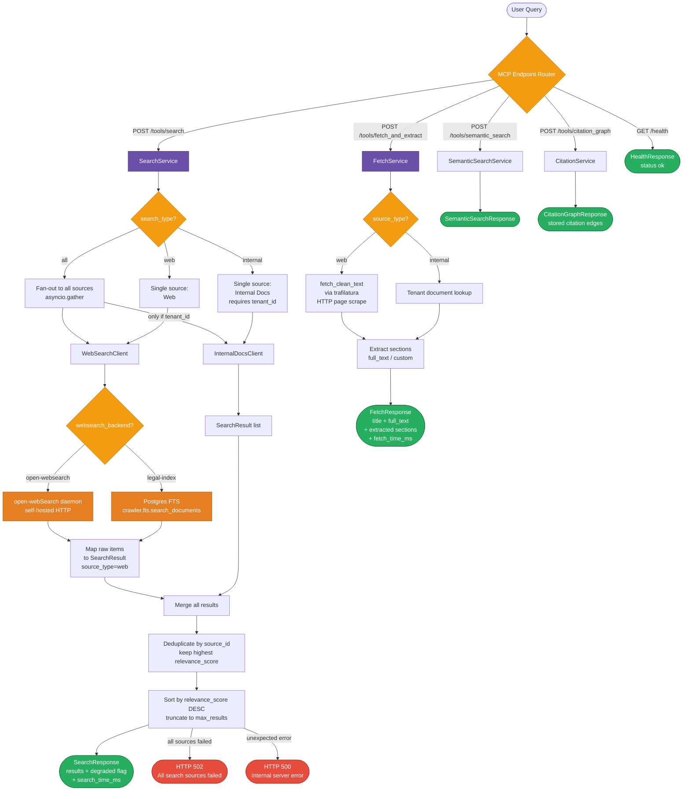

# MCP Retrieval Server — Flow Diagram

## Summary of All Retrieval Types

| Tool | Endpoint | Source | Phase |
|------|----------|--------|-------|
| Unified Search | `/tools/search` | **Web (open-webSearch)** — self-hosted HTTP daemon | Live |
| Unified Search | `/tools/search` | **Web (legal-index)** — Postgres FTS over crawled docs | Live |
| Unified Search | `/tools/search` | **Internal Docs** — tenant-scoped private documents | Live |
| Fetch & Extract | `/tools/fetch_and_extract` | **Web pages** — trafilatura HTTP scrape | Live |
| Fetch & Extract | `/tools/fetch_and_extract` | **Internal Docs** — tenant document store | Live |
| Semantic Search | `/tools/semantic_search` | **Vector store** — embedding similarity | Live |
| Citation Graph | `/tools/citation_graph` | **Graph traversal** — stored citation edges | Live |
