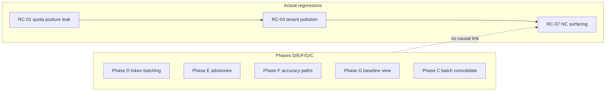

# Phase RC-14/15/16 — Quote Repair Fail-Open, IPC Band Hierarchy & Phase D–G Clarification

**Version:** 1.0  
**ID:** `DR-PHASE-RC141516`  
**Parent:** [PHASE_B_RC0102_QUOTA_POSTURE_FIX_PLAN.md](./PHASE_B_RC0102_QUOTA_POSTURE_FIX_PLAN.md) · [PHASE_RC0304_FUNNEL_TENANT_FIX_PLAN.md](./PHASE_RC0304_FUNNEL_TENANT_FIX_PLAN.md) · [PHASE_RC050607_CAP_IPC_F5_RECOVERY_PLAN.md](./PHASE_RC050607_CAP_IPC_F5_RECOVERY_PLAN.md) · [PHASE_RC111213_CISCO_PROFILE_WALL_PLAN.md](./PHASE_RC111213_CISCO_PROFILE_WALL_PLAN.md) · IPC master (`obligation_ipc_rate` 0.50–0.65 post-IPC-2 target)  
**Targets:** RC-14 (grounding 429 battery crash) · RC-15 (IPC 0.50–0.65 misread) · RC-16 (D/E/F/G did not cause drop)  
**Status:** **IMPLEMENTED**  
**Scope:** Close B-RC-F5 grounding gap + G IPC interpretation hierarchy — **no batch size reduction**, **non-deterministic routing preserved**, **wall time not increased** on successful full-funnel runs  
**Effort:** ~0.5 day (RC-14) + ~0.25 day (RC-15) + ~0.1 day (RC-16 docs) + one ULA + full battery re-run  
**Risk:** Low (tail-path fail-open mirrors proven compare pattern); RC-15 is observability/docs only

**Prerequisite:** [B-RC](./PHASE_B_RC0102_QUOTA_POSTURE_FIX_PLAN.md) · [RC-0304](./PHASE_RC0304_FUNNEL_TENANT_FIX_PLAN.md) · [RC-111213](./PHASE_RC111213_CISCO_PROFILE_WALL_PLAN.md) deployed.

---

## 1. Problem statement

Battery and golden runs still misread **tail-path failures** and **IPC metrics**, causing aborts or wrong tuning direction.

| RC | Symptom | Misread |
|----|---------|---------|
| **RC-14** | ULA step **crashed**: `repair_quotes_batch` → 429 in `grounding_node` | “Need smaller quote repair batches” |
| **RC-15** | Master plan cites `obligation_ipc_rate` **0.50–0.65** as target | “High IPC (0.9) is always bad — tune gates down” |
| **RC-16** | Ops suspects Phases D/E/F/G regressions | “Token batching or baseline flags broke accuracy” |

### Evidence

**RC-14 — ULA battery abort**

| Stage | Behavior today | Desired |
|-------|----------------|---------|
| `section_compare_llm_node` | `compare_branch_fail_open=True` → review continues | ✓ |
| `obligation_compare_node` | same fail-open | ✓ |
| `grounding_node` | **no** try/except — exception propagates → graph abort | fail-open, keep findings |
| `repair_quotes_batch` | catches `classify_llm_failure==QUOTA` | **gap:** `httpx.HTTPStatusError(429)` may classify as `UNKNOWN` |
| Batch non-quota fallback | re-runs `_repair_single` per job | under HOT → **N extra LLM calls**, time ↑ |

**RC-15 — IPC band confusion**

| IPC pattern | `compare_queued` | `llm_batches` | Meaning |
|-------------|------------------|---------------|---------|
| **0.90** (Atlassian P5 baseline) | **34** | **8** | Evidence gates working; many obligations skipped **with reason** |
| **0.90+** + `compare_queued=0` | **0** | **0** | **Pathological** (RC-03) — no compares ran |
| **0.50–0.65** (IPC master post-IPC-2) | **≥ floor** | **≥ floor** | **Healthy aspirational** — more evidence reaches compare after retrieval/index fix |
| **0.50–0.65** forced by lowering gates | low | low | **False accuracy** — RC-03/Phase F violation |

**RC-16 — Actual drop causality**

| Phase | What it does | Caused accuracy drop? |
|-------|--------------|----------------------|
| **D** | Token-aware batching (same compares, fewer splits) | **No** |
| **E** | Config advisory (warn on bad operator config) | **No** — E2b fired, not blocking |
| **F** | Protect F1–F5 accuracy paths | **No** — F5 would help if quota + gaps present |
| **G** | Baseline interpretation / golden bands | **No** — observability only |
| **C** | Batch consolidation | **No** — fewer calls, not fewer gates |

**Drop caused by (test conditions):** RC-01 (429 posture leak) + RC-04 (tenant pollution) + RC-07 (NC flags surfaced) — not algorithm intent.

---

## 2. Code-proven root causes

### RC-14a — `grounding_node` has no fail-open wrapper ⭐ P0

**Files:** `graph/nodes.py` L179–244 · contrast `section_compare_nodes.py` L213–234

```python
async def grounding_node(...):
    ground_states, grounding_stats = await ground_findings_quotes(...)  # ← unguarded
```

Compare branches catch all non-fatal exceptions when `compare_branch_fail_open=True` (default). Grounding does not — **one unhandled 429 aborts the entire review** and battery.

**Effect:** RC-14 — ULA never reaches report; downstream contracts untested.

---

### RC-14b — Quota detection gap in quote repair ⭐ P0

**Files:** `quote_repair_llm.py` L56–59 · `failure_policy.py` L55–65 · `llm_gateway.py` L79–106

`repair_quotes_batch` uses `classify_llm_failure(exc)` which inspects **`str(exc)` only**.

`llm_gateway._is_rate_limit_error()` walks **`__cause__` / `__context__`** and checks `httpx.HTTPStatusError.status_code == 429`.

When LangChain/Mistral wraps 429, repair may see `UNKNOWN` → batch path falls through to per-job `_repair_single` loop → still may raise or fan-out under HOT.

**B-RC-F5 partial:** `test_quote_repair_quota.py` passes for `RuntimeError("429 rate limit exceeded")` but not for wrapped `HTTPStatusError`.

---

### RC-14c — Batch failure fan-out under pressure ⭐ P1

**Files:** `quote_repair_llm.py` L173–180

```python
except Exception as exc:
    if _is_quota_or_unavailable(exc):
        ...  # skip batch
        continue
    for job in batch:
        await _repair_single(job)  # ← up to batch_size extra calls
```

On STRUCTURE/UNKNOWN batch failure while review is **HOT**, fan-out multiplies LLM calls — **increases wall time** and 429 risk. Compare path does **not** do this; it splits batch→single only via `should_batch_single_retry`.

**Effect:** Tail grounding becomes the slowest, crashiest stage in battery tail.

---

### RC-14d — No grounding resilience in diagnosis ⭐ P2

**Files:** `engine_diagnosis.py` · `grounding_quote.py` stats

`compliance_stats` tracks `quote_repair_batch_calls` but not `quote_repair_quota_skipped` or `grounding_fail_open`. Ops cannot distinguish “review completed with ungrounded quotes” vs “grounding never ran.”

---

### RC-15a — IPC master 0.50–0.65 is a **post-IPC-2** target, not a golden gate ⭐ P0

**Files:** IPC master plan · `atlassian_v1.json` (`obligation_ipc_rate: 0.9`) · `golden_thresholds.json` (`max_obligation_ipc_rate: 0.95`)

Current committed baseline **expects ~0.9 IPC** with **34 compare_queued** — that is **healthy evidence-driven skipping**, not flood.

Master plan band **0.50–0.65** applies **after** IPC-2 improves sync/index and more obligations pass F4 with real evidence — **not** by lowering `evidence_min_*` (Phase F forbids).

**Misread:** Treating 0.9 → 0.6 as “improvement” while `compare_queued` drops to 0 is RC-03 pathological, not IPC-2 success.

---

### RC-15b — G flags lack explicit IPC hierarchy ⭐ P1

**Files:** `baseline_interpretation.py` L186–246

Today:

1. `accuracy_regression` when `violations_nc < baseline_min` ✓  
2. `pathological_ipc_funnel` when high IPC + `compare_queued=0` ✓  
3. `ipc_expected_high` when `ipc_actual >= 0.75` (informational)  
4. `section_nc_regression` when NC low + IPC high (without pathological flag) ✓  

**Missing:** Positive signal when IPC is **lower than baseline** but **funnel work ran** (`compare_queued`, batches, NC ok) — should read as `ipc_evidence_healthy` / “aspirational band progress”, **not** regression.

**Missing:** `ipc_target_band` note in interpretation payload so operators do not chase 0.65 prematurely.

---

### RC-15c — No advisory when operator adds premature IPC ceiling ⭐ P2

**Files:** `golden_thresholds.json` · `config_advisory.py`

If someone adds `"max_obligation_ipc_rate": 0.65` to golden thresholds **before** IPC-2, good P5 runs (0.9 IPC, 34 queued) would false-fail. No E-rule warns about this misconfiguration.

---

### RC-16 — Documentation gap only ⭐ P2

No single RCA doc ties RC-01/04/07 chain to battery evidence. Phase D/E/F/G plans are correct but ops reads IPC number in isolation.

**Fix:** RC-16 section in this plan + README row — **no production code** except optional `plans/RCA_BATTERY_ACCURACY_DROP.md` pointer.

---

## 3. Design principles

### 3.1 Non-deterministic (required)

| Mechanism | Why |
|-----------|-----|
| Existing 429 jitter / HOT acquire pause | unchanged |
| Fail-open keeps findings with `grounding_failed` metadata | no fixed “skip all grounding” |
| Quote repair skip per-job on quota | same batch_size; jobs independently skip |
| No new fixed sleeps in grounding | time neutral |

### 3.2 Do not reduce batch sizes

| Unchanged | Reason |
|-----------|--------|
| `quote_repair_batch_size` (6) | Phase C consolidation |
| `section_compare_batch_size` (8) | Phase D token batching |
| `obligation_extract_batch_size` (6) | throughput |

### 3.3 Accuracy hierarchy (RC-15)

```
1. violations_nc  vs baseline_min     → primary_accuracy (hard)
2. compare_queued / llm_batches       → funnel work ran?
3. pathological_ipc_funnel          → high IPC + zero compares (RC-03)
4. obligation_ipc_rate band         → informational / post-IPC-2 aspirational only
```

**Never** tune F4 evidence gates to hit 0.50–0.65 IPC without IPC-2 retrieval improvement.

### 3.4 Time budget (must not increase)

| Change | Time impact |
|--------|-------------|
| Grounding fail-open | **↓** — battery completes vs full abort + rerun |
| Stop HOT fan-out on batch repair failure | **↓** — skip N singles under pressure |
| Shared 429 classifier | **↓** — fewer misclassified retries |
| RC-15 G flags / docs | **0** — observability only |

**Target:** ULA + full battery complete; Atlassian golden wall time ≤ baseline on good run.

---

## 4. Implementation tasks

### RC14-F1 — Shared quota classifier for quote repair ⭐ P0 · ~15 LOC

| Field | Detail |
|-------|--------|
| **Files** | `failure_policy.py` or `quote_repair_llm.py` |
| **Change** | `_is_quota_or_unavailable(exc)` calls `llm_gateway._is_rate_limit_error(exc)` **or** extract shared `is_rate_limited(exc)` used by both gateway and repair |
| **Also** | Treat `FailureClass.UNAVAILABLE` + `QUOTA` as skip |

```python
def is_rate_limited(exc: BaseException) -> bool:
    from review_agent.models.llm_gateway import _is_rate_limit_error
    if isinstance(exc, LLMUnavailableError):
        return True
    if _is_rate_limit_error(exc):
        return True
    return classify_llm_failure(exc) == FailureClass.QUOTA
```

| **Acceptance** | Mock `httpx.HTTPStatusError(429)` wrapped in `RuntimeError`: batch repair skips, no raise |
| **Tests** | Extend `test_quote_repair_quota.py` with wrapped 429 |

---

### RC14-F2 — `grounding_branch_fail_open` + node wrapper ⭐ P0 · ~35 LOC

| Field | Detail |
|-------|--------|
| **Files** | `config.py`, `graph/nodes.py` |
| **Config** | `grounding_branch_fail_open: bool = True` (mirror `compare_branch_fail_open`) |
| **Change** | Wrap `grounding_node` body in try/except; on failure return input findings as `grounded_findings` with stats flag |

```python
async def grounding_node(state, client):
    settings = get_settings()
    try:
        return await _grounding_node_impl(state, client, settings)
    except FatalPipelineError:
        raise
    except Exception as exc:
        if not settings.grounding_branch_fail_open:
            raise
        prior = dict(state.get("compliance_stats") or {})
        findings = state.get("findings") or []
        return {
            "grounded_findings": findings,
            "warnings": [f"grounding branch failed (fail-open): {exc}"],
            "compliance_stats": {
                **prior,
                "grounding_fail_open": True,
                "grounding_fail_reason": str(exc)[:500],
            },
        }
```

| **Accuracy** | Findings preserved; quotes may be ungrounded — same trade as compare fail-open |
| **Acceptance** | Mock 429 in `repair_quotes_batch` with classifier gap: review completes, `grounding_fail_open` or per-finding `grounding_failed` |
| **Tests** | `test_grounding_fail_open.py` (new) |

---

### RC14-F3 — Quote repair batch: no HOT fan-out ⭐ P1 · ~20 LOC

| Field | Detail |
|-------|--------|
| **Files** | `quote_repair_llm.py` |
| **Change** | On batch exception **not** rate-limited: if `get_current_review_posture() != NORMAL`, fail-open entire batch (quota skip result per job) instead of `_repair_single` loop |
| **If NORMAL** | Keep existing structure fallback to singles (recovery path) |

```python
except Exception as exc:
    if is_rate_limited(exc) or get_current_review_posture() != ReviewPosture.NORMAL:
        for job in batch:
            out[job.repair_id] = _quota_skip_result()
            stats["quote_repair_quota_skipped"] = stats.get(...) + 1
        continue
    for job in batch:
        await _repair_single(job)
```

| **Acceptance** | HOT + structure batch failure: 1 batch call, 0 singles, review completes |
| **Time** | Prevents tail fan-out — **wall time decreases** under pressure |

---

### RC14-F4 — Grounding stats in diagnosis ⭐ P2 · ~12 LOC

| Field | Detail |
|-------|--------|
| **Files** | `engine_diagnosis.py`, `grounding_quote.py` |
| **Change** | Surface in `infrastructure.grounding` or `compliance_stats` passthrough: `quote_repair_quota_skipped`, `grounding_fail_open`, `quote_repair_batch_calls` |
| **Acceptance** | ULA diagnosis after 429 shows skip count; battery log explains completion |

---

### RC14-F5 — Tests ⭐ P0 · ~60 LOC

| Test file | Covers |
|-----------|--------|
| `tests/test_quote_repair_quota.py` | RC14-F1 wrapped httpx 429 |
| `tests/test_grounding_fail_open.py` | RC14-F2 node wrapper |
| `tests/test_quote_repair_llm.py` | RC14-F3 HOT no fan-out |
| `tests/test_engine_diagnosis.py` | RC14-F4 stats (optional) |

---

### RC15-F1 — IPC interpretation hierarchy in G ⭐ P1 · ~35 LOC

| Field | Detail |
|-------|--------|
| **Files** | `baseline_interpretation.py`, `atlassian_v1.json` |
| **Change** | Add to interpretation payload: |

```python
"ipc_interpretation": {
    "hierarchy": ["violations_nc", "funnel_work", "ipc_rate_band"],
    "target_band_post_ipc2": [0.50, 0.65],  # aspirational, not gate
    "current_baseline_ipc": ipc_baseline,
    "status": "evidence_healthy" | "pathological" | "aspirational_progress" | "neutral",
}
```

| **Rules** | |
|-----------|--|
| `pathological` | `pathological_ipc_funnel` flag set |
| `evidence_healthy` | NC ≥ baseline_min AND `compare_queued` ≥ 50% baseline AND batches ≥ 50% baseline (IPC rate any) |
| `aspirational_progress` | funnel work ok AND `ipc_actual` within 0.50–0.65 AND IPC-2 note |
| `neutral` | otherwise |

| **Do not** | Add `max_obligation_ipc_rate: 0.65` to `golden_thresholds.json` in v1 |
| **Acceptance** | P5 baseline (0.9 IPC, 34 queued, NC 6) → `evidence_healthy`; LIVE pathological (0.9, queued 0) → `pathological` |

---

### RC15-F2 — Funnel-first IPC health flag ⭐ P1 · ~15 LOC

| Field | Detail |
|-------|--------|
| **Files** | `baseline_interpretation.py` |
| **Flag** | `ipc_evidence_healthy` when RC15-F1 status is `evidence_healthy` |
| **Flag** | `ipc_aspirational_band` when status is `aspirational_progress` (post-IPC-2) |
| **Story** | Extend `_build_funnel_story` with `ipc={rate}` when present |
| **Tests** | `test_baseline_interpretation.py` — 3 cases: pathological, healthy high IPC, aspirational low IPC |

---

### RC15-F3 — Config advisory E11 (premature IPC ceiling) ⭐ P2 · ~18 LOC

| Field | Detail |
|-------|--------|
| **Files** | `config_advisory.py` |
| **Rule E11** | Warn if env suggests `max_obligation_ipc_rate` < 0.75 in golden thresholds **without** `IPC2_BASELINE_MODE=enabled` (or document-only check in `validate_p5_golden` comment) |
| **Message** | “IPC 0.50–0.65 is post-IPC-2 target; lowering ceiling before retrieval fix causes RC-03 false compares” |
| **Acceptance** | Advisory fires on misconfigured threshold file in test harness |

**Minimal alternative:** Document-only in `golden_thresholds.json` comment + RC15-F1 payload — skip E11 if avoiding harness env coupling.

---

### RC15-F4 — Baseline snapshot note ⭐ P2 · ~10 LOC

| Field | Detail |
|-------|--------|
| **Files** | `atlassian_v1.json`, `export_assessment.py` |
| **Change** | Add `"ipc_notes": "0.9 IPC with 34 queued is healthy pre-IPC-2; 0.50-0.65 is aspirational after IPC-2 retrieval improvement"` |
| **export** | Pass `ipc_interpretation.status` into assessment when baseline profile loaded |

---

### RC16-F1 — RCA clarification doc ⭐ P2 · ~0 LOC prod

| Field | Detail |
|-------|--------|
| **Files** | This plan §1 + §5, `plans/README.md` |
| **Content** | Phase table (D/E/F/G/C), causality chain diagram, “what to fix first” ordered list |
| **No code** | Unless linking from `IMPLEMENTATION_PLAN.md` |

---

### RC16-F2 — README + master plan cross-link ⭐ P2

| Field | Detail |
|-------|--------|
| **Files** | `plans/README.md`, IPC master plan (when present) |
| **Change** | Add RC-14/15/16 row; note IPC 0.50–0.65 is **post-IPC-2**, gated behind funnel-work checks |

---

## 5. RC-16 — Phase attribution (reference)

### What did **not** cause the battery accuracy drop



| Investigation question | Answer |
|------------------------|--------|
| Did Phase D reduce compares? | No — same sections/obligations; fewer token splits only |
| Did Phase E block routing? | No — warn-only; E2b logged |
| Did Phase F skip F5? | No — F5 starved because gaps never formed (RC-03 funnel) |
| Did Phase G change gates? | No — interpretation + export only |
| Did Phase C shrink work? | No — batches merged LLM calls; batch sizes unchanged |

### Fix order for operators

1. **RC-12** golden LLM profile (`mistral_conservative`)  
2. **RC-04** tenant isolation + `replace_policies=True`  
3. **RC-03** `compare_queued` funnel (routing scope, catalog size)  
4. **RC-14** grounding fail-open (battery completion)  
5. **IPC-2** re-sync / index quality — **then** re-measure toward 0.50–0.65  
6. **RC-15** read G `ipc_interpretation` — do not tune IPC gates before step 5  

---

## 6. Implementation order

| Priority | Task | Fixes | LOC |
|----------|------|-------|-----|
| **P0** | RC14-F1 shared 429 classifier | RC-14 | 15 |
| **P0** | RC14-F2 grounding fail-open | RC-14 | 35 |
| **P0** | RC14-F5 core tests | lock | 45 |
| **P1** | RC14-F3 HOT no fan-out | RC-14 · time | 20 |
| **P1** | RC15-F1/F2 IPC hierarchy | RC-15 · G | 50 |
| **P2** | RC14-F4 diagnosis stats | RC-14 | 12 |
| **P2** | RC15-F3/F4 advisory + baseline note | RC-15 | 28 |
| **P2** | RC16-F1/F2 docs | RC-16 | 0 prod |

**Total prod LOC:** ~130 (excluding tests/docs)

---

## 7. Validation checklist

### RC-14

1. `pytest tests/test_quote_repair_quota.py tests/test_grounding_fail_open.py -q`
2. Mock battery: ULA review with 429 on quote repair → **completes**, `grounding_fail_open` or per-finding downgrade
3. Full battery: no crash on ULA step; NDA/EULA still run
4. Good Atlassian run: grounding stats normal; wall time not increased

### RC-15

1. `pytest tests/test_baseline_interpretation.py -k ipc -q`
2. P5 Atlassian: `ipc_interpretation.status == evidence_healthy` despite `obligation_ipc_rate ≈ 0.9`
3. LIVE pathological: `status == pathological`, not “IPC improved to 0.6”
4. `golden_thresholds.json` — **no** `max_obligation_ipc_rate: 0.65` added

### RC-16

1. README lists RC-14/15/16 with correct status
2. Team sign-off: IPC tuning deferred until IPC-2 + funnel green

---

## 8. Rollback

| Flag / change | Rollback |
|---------------|----------|
| `grounding_branch_fail_open=false` | Restore hard-fail grounding (debug only) |
| RC14-F3 HOT skip | Revert to single fan-out (not recommended) |
| RC15 interpretation fields | Ignored by gates; safe to leave |

---

## 9. Out of scope (explicit)

| Proposal | Why excluded |
|----------|--------------|
| Reduce `quote_repair_batch_size` | Violates Phase C / user constraint |
| Disable quote repair globally on 429 | Loses grounding accuracy without need — per-job skip enough |
| Add `max_obligation_ipc_rate: 0.65` golden gate now | Causes false fails; RC-15 defers to post-IPC-2 |
| Lower F4 evidence gates for IPC target | Phase F forbids; creates RC-03 false compares |
| Deterministic grounding order | Violates non-deterministic constraint |
| Extra sleep in grounding | Increases wall time |

---

## 10. Success criteria

| Metric | Before | After |
|--------|--------|-------|
| ULA battery crash on grounding 429 | yes | **no** |
| Full 5-contract battery completion | aborts at ULA | **completes** |
| `obligation_ipc_rate` misread as sole KPI | common | **hierarchy documented** |
| P5 run with 0.9 IPC + 34 queued | “IPC too high” | **`ipc_evidence_healthy`** |
| Phase D/E/F/G blamed for drop | yes | **RC-16 RCA closed** |
| Wall time on successful Atlassian golden | baseline | **≤ baseline** |

---

**Next step:** Implement RC14-F1 + RC14-F2 + tests (P0), then RC15-F1/F2 before next IPC tuning discussion.
